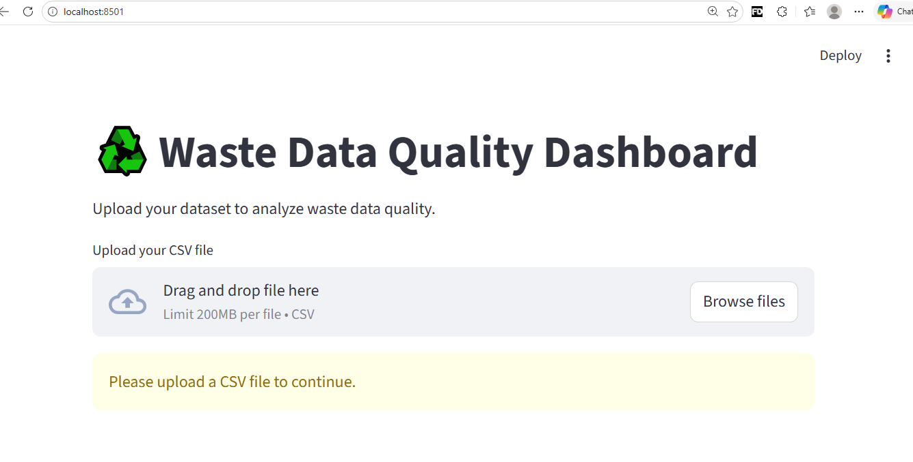
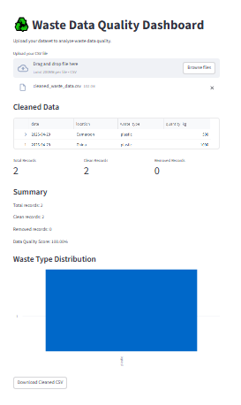

# Waste Data Quality Dashboard ♻️

A Streamlit dashboard for cleaning and validating waste datasets before analytics or AI workflows.

## Features

* Removes invalid records
* Detects missing locations
* Calculates data quality score
* Visualizes waste distribution
* Exports cleaned CSV files

## Tech Stack

* Python
* Pandas
* Streamlit

## Screenshots

### Before Upload

### After Upload

## Goal

This project focuses on improving data quality for sustainability and analytics workflows.
